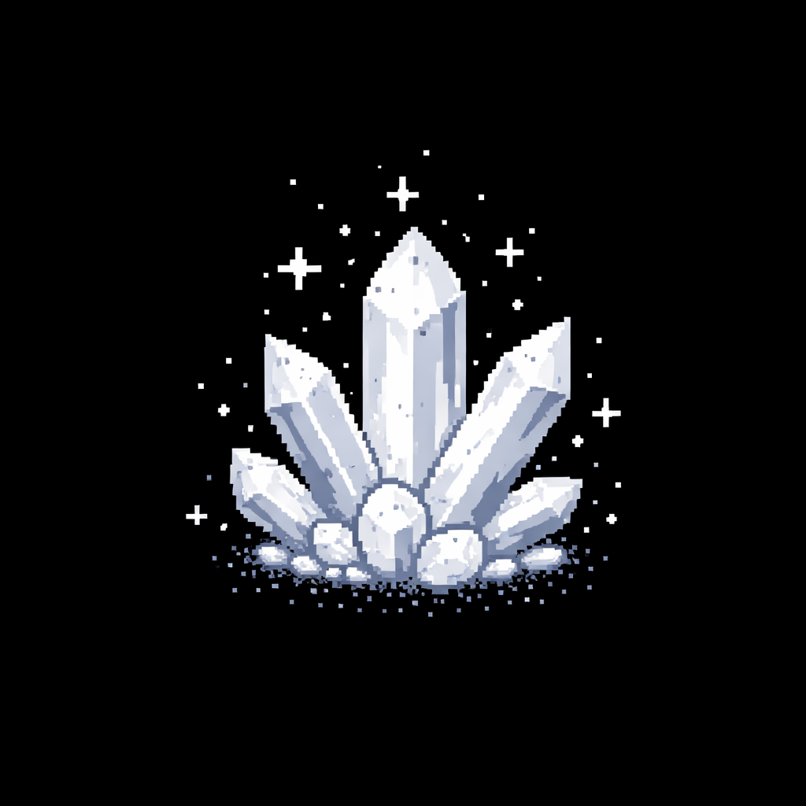

# Quartz 2D Game Engine

<p align="center">
  
</p>

A Rust 2D game engine built on Prism with physics, animations, and event-driven gameplay.

## Canvas

The game world that manages objects and scaling.
```rust
let mut canvas = Canvas::new(ctx, CanvasMode::Landscape);
// CanvasMode::Landscape = 3840×2160 (16:9)
// CanvasMode::Portrait = 2160×3840 (9:16)
```

### canvas.add_game_object()
Adds a GameObject to the canvas.
```rust
canvas.add_game_object("player".to_string(), player_object);
```

### canvas.remove_game_object()
Removes a GameObject by name.
```rust
canvas.remove_game_object("enemy");
```

### canvas.get_game_object()
Gets an immutable reference to a GameObject.
```rust
let obj = canvas.get_game_object("player");
if let Some(player) = obj {
    println!("Position: {:?}", player.position);
}
```

### canvas.get_game_object_mut()
Gets a mutable reference to modify a GameObject directly.
```rust
if let Some(player) = canvas.get_game_object_mut("player") {
    player.visible = false;
    player.position = (100.0, 200.0);
}
```

### canvas.run()
Executes an action immediately. This is the main way to modify game state programmatically.
```rust
// Make player jump
canvas.run(Action::ApplyMomentum {
    target: Target::ById("player".to_string()),
    value: (0.0, -20.0)
});

// Remove all enemies
canvas.run(Action::Remove {
    target: Target::ByTag("enemies".to_string())
});

// Spawn bullet at player position
canvas.run(Action::Spawn {
    object: Box::new(bullet),
    location: Location::AtTarget(Box::new(Target::ById("player".to_string())))
});
```

### canvas.add_event()
Registers an event that triggers actions automatically when conditions are met.
```rust
// Jump when W is pressed
canvas.add_event(
    GameEvent::KeyPress {
        key: Key::Character("w".to_string().into()),
        action: Action::ApplyMomentum {
            target: Target::ById("player".to_string()),
            value: (0.0, -15.0)
        },
        target: Target::ById("player".to_string())
    },
    Target::ById("player".to_string())
);

// Remove bullet on collision
canvas.add_event(
    GameEvent::Collision {
        action: Action::Remove {
            target: Target::ById("bullet".to_string())
        },
        target: Target::ById("bullet".to_string())
    },
    Target::ById("bullet".to_string())
);
```

### canvas.on_tick()
Runs custom code every frame (~60 FPS). Use for game logic that needs to run continuously.
```rust
let mut counter = 0;
canvas.on_tick(move |canvas| {
    counter += 1;
    if counter >= 60 {  // Every second
        counter = 0;
        // Spawn enemy
        if let Some(player) = canvas.get_game_object("player") {
            println!("Player at: {:?}", player.position);
        }
    }
});
```

### canvas.collision_between()
Checks if two targets are colliding right now.
```rust
if canvas.collision_between(
    &Target::ById("player".to_string()),
    &Target::ByTag("enemies".to_string())
) {
    // Player hit enemy!
    canvas.run(Action::Remove {
        target: Target::ById("player".to_string())
    });
}
```

### canvas.show() / hide() / toggle_visibility()
Control object visibility by name.
```rust
canvas.show("powerup");
canvas.hide("secret_door");
canvas.toggle_visibility("indicator");
```

### canvas.is_visible()
Check if object is visible.
```rust
if canvas.is_visible("key") {
    canvas.show("door");
}
```

### canvas.get_virtual_size()
Gets the virtual canvas size (before scaling).
```rust
let (width, height) = canvas.get_virtual_size();
// Landscape: (3840.0, 2160.0)
// Portrait: (2160.0, 3840.0)
```

### canvas.get_scale()
Gets the current scaling factor from virtual to actual screen size.
```rust
let scale = canvas.get_scale();
```

### canvas.get_mode()
Gets the canvas mode.
```rust
let mode = canvas.get_mode();
// CanvasMode::Landscape or CanvasMode::Portrait
```

### canvas.is_key_held()
Check if a key is currently pressed down.
```rust
if canvas.is_key_held(&Key::Character("w".to_string().into())) {
    // W key is held down
}
```

### canvas.handle_infinite_scroll(direction, tag)
Enables infinite scrolling for objects with a specific tag. When objects move off-screen, they wrap around to create a seamless loop.

**Parameters:**
- `direction: ScrollDirection` - Direction (`Left`, `Right`, `Up`, `Down`)
- `tag: &str` - Tag name for objects that should scroll (use any name)

**Example:**
```rust
// Load background image
let bg_image = Image::from_file(ctx, "background.png").unwrap();

// Create two background tiles for seamless scrolling
let bg1 = GameObject::new_rect(
    ctx, "bg1".to_string(), bg_image.clone(),
    (3840.0, 2160.0),               // Size
    (0.0, 0.0),                     // Position - starts at left
    vec!["background".to_string()], // Tag
    (-5.0, 0.0),                    // Momentum - moves left
    (1.0, 1.0), 0.0
);

let bg2 = GameObject::new_rect(
    ctx, "bg2".to_string(), bg_image.clone(),
    (3840.0, 2160.0),               // Size
    (3840.0, 0.0),                  // Position - right after bg1
    vec!["background".to_string()], // Same tag
    (-5.0, 0.0),                    // Same momentum
    (1.0, 1.0), 0.0
);

canvas.add_game_object("bg1".to_string(), bg1);
canvas.add_game_object("bg2".to_string(), bg2);

// Scrolling happens automatically based on momentum!
// Or call manually:
canvas.handle_infinite_scroll(ScrollDirection::Left, "background");
```

**Requirements:**
- At least 2 objects with the same tag
- Objects wrap when they move ~10px off-screen


## GameObject

Game entities with physics and visuals.

### GameObject::new()
Creates a square GameObject.
```rust
let player = GameObject::new(
    ctx,
    "player_id".to_string(),     // Unique ID
    image,                        // Image to display
    100.0,                        // Size (100×100 square)
    (200.0, 300.0),              // Position (x, y)
    vec!["player".to_string()],  // Tags for targeting
    (0.0, 0.0),                  // Initial momentum (vx, vy)
    (0.95, 0.95),                // Resistance (friction, 0.0-1.0)
    0.5,                          // Gravity (added to vy each frame)
);
```

### GameObject::new_rect()
Creates a rectangular GameObject (width and height can differ).
```rust
let platform = GameObject::new_rect(
    ctx,
    "platform".to_string(),
    image,
    (800.0, 50.0),               // Width × Height
    (0.0, 1000.0),
    vec!["platforms".to_string()],
    (0.0, 0.0),
    (1.0, 1.0),
    0.0,
);
```

### .as_platform()
Makes the object solid - other objects will land on it and stop falling.
```rust
let ground = GameObject::new_rect(ctx, ...)
    .as_platform();  // Now objects can stand on this
```

### .with_animation()
Adds an AnimatedSprite to the GameObject.
```rust
let sprite = AnimatedSprite::new(
    include_bytes!("../assets/walk.gif"),
    (100.0, 100.0),
    12.0
)?;

let animated_player = GameObject::new(ctx, ...)
    .with_animation(sprite);
```

### object.visible
Controls whether the object is drawn and participates in physics.
```rust
if let Some(obj) = canvas.get_game_object_mut("powerup") {
    obj.visible = false;  // Hide it
}
```

### object.position
The (x, y) position of the object.
```rust
if let Some(obj) = canvas.get_game_object_mut("player") {
    obj.position = (100.0, 200.0);  // Teleport
}
```

### object.momentum
The (vx, vy) velocity of the object. Position changes by momentum each frame.
```rust
if let Some(obj) = canvas.get_game_object_mut("player") {
    obj.momentum = (10.0, 0.0);  // Move right at 10 units/frame
}
```

### object.resistance
Friction/drag applied each frame. Momentum is multiplied by this.
```rust
// High resistance = stops quickly
obj.resistance = (0.8, 0.8);

// Low resistance = slides forever
obj.resistance = (0.99, 0.99);

// No resistance = never stops
obj.resistance = (1.0, 1.0);
```

### object.gravity
Added to vertical momentum each frame. Positive = falls down.
```rust
object.set_gravity(1.2);  // Normal gravity
object.set_gravity(0.0);  // No gravity (space!)
object.set_gravity(-0.5); // Floats upward
```

### object.is_platform
Whether other objects can land on this object.
```rust
if let Some(obj) = canvas.get_game_object_mut("ground") {
    obj.is_platform = true;
}
```

### object.size
The (width, height) of the object in virtual coordinates.
```rust
let size = obj.size;  // (100.0, 100.0)
```

### object.id
The unique identifier string.
```rust
let id = obj.id.clone();  // "player_id"
```

### object.tags
List of tags for group targeting.
```rust
let tags = obj.tags.clone();  // vec!["player", "controllable"]
```

## AnimatedSprite

GIF animations for GameObjects.

### AnimatedSprite::new()
Loads a GIF file and creates an animated sprite.
```rust
let sprite = AnimatedSprite::new(
    include_bytes!("../assets/walk.gif"),  // GIF bytes
    (50.0, 50.0),                          // Display size
    12.0                                    // Frames per second
)?;
```

### sprite.update()
Updates animation (called automatically by Canvas each frame).
```rust
sprite.update(0.016);  // delta_time in seconds
```

### sprite.set_fps()
Changes animation speed.
```rust
sprite.set_fps(24.0);  // Play at 24 FPS
```

### sprite.reset()
Resets animation to first frame.
```rust
sprite.reset();
```

### sprite.set_frame()
Jump to specific frame.
```rust
sprite.set_frame(5);  // Go to frame 5
```

### sprite.frame_count()
Get total number of frames.
```rust
let count = sprite.frame_count();  // 32 frames
```

### sprite.get_current_image()
Get the current frame as an Image.
```rust
let img = sprite.get_current_image();
```

## Actions

Actions modify game state. Use with `canvas.run()` or in events.

### Action::ApplyMomentum
Adds to existing momentum (for jumps, boosts).
```rust
Action::ApplyMomentum {
    target: Target::ById("player".to_string()),
    value: (0.0, -10.0)  // Add upward velocity
}

// Usage:
canvas.run(Action::ApplyMomentum {
    target: Target::ById("player".to_string()),
    value: (5.0, 0.0)  // Boost right
});
```

### Action::SetMomentum
Directly sets momentum (for stopping, movement changes).
```rust
Action::SetMomentum {
    target: Target::ByTag("enemies".to_string()),
    value: (0.0, 0.0)  // Stop all enemies
}

// Usage:
canvas.run(Action::SetMomentum {
    target: Target::ById("player".to_string()),
    value: (10.0, 0.0)  // Move right
});
```

### Action::SetResistance
Changes friction/drag.
```rust
Action::SetResistance {
    target: Target::ById("player".to_string()),
    value: (0.99, 0.99)  // Ice physics - slides more
}

// Usage:
canvas.run(Action::SetResistance {
    target: Target::ById("player".to_string()),
    value: (0.8, 0.8)  // Sticky ground - stops fast
});
```

### Action::Remove
Deletes objects from the game.
```rust
Action::Remove {
    target: Target::ByTag("bullets".to_string())  // Remove all bullets
}

// Usage:
canvas.run(Action::Remove {
    target: Target::ById("enemy_1".to_string())
});
```

### Action::Spawn
Creates new objects at specified location.
```rust
Action::Spawn {
    object: Box::new(new_enemy),
    location: Location::Position((100.0, 200.0))
}

// Usage:
let bullet = GameObject::new(ctx, "bullet".to_string(), ...);
canvas.run(Action::Spawn {
    object: Box::new(bullet),
    location: Location::AtTarget(Box::new(Target::ById("player".to_string())))
});
```

### Action::SetAnimation
Changes the animation of an object.
```rust
Action::SetAnimation {
    target: Target::ById("player".to_string()),
    animation_bytes: include_bytes!("../assets/run.gif"),
    fps: 16.0
}

// Usage:
canvas.run(Action::SetAnimation {
    target: Target::ById("player".to_string()),
    animation_bytes: include_bytes!("../assets/idle.gif"),
    fps: 8.0
});
```

### Action::SetPosition / Teleport
Moves object to location. Both do the same thing.
```rust
Action::Teleport {
    target: Target::ById("player".to_string()),
    location: Location::Position((0.0, 0.0))
}

// Usage:
canvas.run(Action::Teleport {
    target: Target::ById("player".to_string()),
    location: Location::OnTarget {
        target: Box::new(Target::ById("spawn_point".to_string())),
        anchor: Anchor::Center,
        offset: (0.0, 0.0)
    }
});
```

### Action::Show / Hide / Toggle
Control visibility.
```rust
Action::Show { target: Target::ById("powerup".to_string()) }
Action::Hide { target: Target::ById("enemy".to_string()) }
Action::Toggle { target: Target::ById("door".to_string()) }

// Usage:
canvas.run(Action::Show {
    target: Target::ByTag("collectibles".to_string())
});
```

### Action::Conditional
Execute different actions based on conditions.
```rust
Action::Conditional {
    condition: Condition::IsVisible(Target::ById("key".to_string())),
    if_true: Box::new(Action::Show {
        target: Target::ById("door".to_string())
    }),
    if_false: Some(Box::new(Action::Hide {
        target: Target::ById("door".to_string())
    }))
}

// Usage:
canvas.run(Action::Conditional {
    condition: Condition::KeyHeld(Key::Character("shift".to_string().into())),
    if_true: Box::new(Action::SetMomentum {
        target: Target::ById("player".to_string()),
        value: (20.0, 0.0)  // Sprint
    }),
    if_false: Some(Box::new(Action::SetMomentum {
        target: Target::ById("player".to_string()),
        value: (10.0, 0.0)  // Walk
    }))
});
```

### Action::TransferMomentum
Transfer momentum from one object to another (averaged and scaled).
```rust
Action::TransferMomentum {
    from: Target::ById("ball".to_string()),
    to: Target::ById("player".to_string()),
    scale: 0.5  // Transfer 50% of momentum
}

// Usage:
canvas.run(Action::TransferMomentum {
    from: Target::ById("explosion".to_string()),
    to: Target::ByTag("debris".to_string()),
    scale: 2.0  // 200% knockback
});
```

## Targets

Select which objects an action affects.

### Target::ById
Target single object by unique ID.
```rust
Target::ById("player".to_string())
Target::ById("enemy_3".to_string())
```

### Target::ByTag
Target all objects with a specific tag.
```rust
Target::ByTag("enemies".to_string())
Target::ByTag("collectibles".to_string())
```

### Target::ByName
Target object by the name used in `add_game_object()`.
```rust
Target::ByName("player".to_string())
```

## Locations

Specify where to place objects.

### Location::Position
Absolute (x, y) coordinates.
```rust
Location::Position((100.0, 200.0))
```

### Location::AtTarget
At another object's position.
```rust
Location::AtTarget(Box::new(Target::ById("player".to_string())))
```

### Location::Between
Midpoint between two objects.
```rust
Location::Between(
    Box::new(Target::ById("player".to_string())),
    Box::new(Target::ById("enemy".to_string()))
)
```

### Location::Relative
Offset from another object.
```rust
Location::Relative {
    target: Box::new(Target::ById("player".to_string())),
    offset: (50.0, 0.0)  // 50 units to the right
}
```

### Location::OnTarget
Position relative to object using anchors.
```rust
Location::OnTarget {
    target: Box::new(Target::ById("platform".to_string())),
    anchor: Anchor::TopCenter,
    offset: (0.0, -10.0)  // 10 units above center
}
```

## Anchors

Reference points on objects for positioning.
```rust
Anchor { x: 0.5, y: 0.5 }  // Center (0.0-1.0 range)
Anchor { x: 0.25, y: 0.75 } // 25% from left, 75% from top
```

## Conditions

Check game state before executing actions.

### Condition::Always
Always true.
```rust
Condition::Always
```

### Condition::KeyHeld
True if key is currently pressed.
```rust
Condition::KeyHeld(Key::Character("w".to_string().into()))
```

### Condition::KeyNotHeld
True if key is not pressed.
```rust
Condition::KeyNotHeld(Key::Character("space".to_string().into()))
```

### Condition::Collision
True if target is colliding with any object.
```rust
Condition::Collision(Target::ById("player".to_string()))
```

### Condition::NoCollision
True if target is not colliding.
```rust
Condition::NoCollision(Target::ById("player".to_string()))
```

### Condition::IsVisible
True if target is visible.
```rust
Condition::IsVisible(Target::ById("powerup".to_string()))
```

### Condition::IsHidden
True if target is hidden.
```rust
Condition::IsHidden(Target::ById("secret".to_string()))
```

### Condition::And
Both conditions must be true.
```rust
Condition::And(
    Box::new(Condition::KeyHeld(Key::Character("w".to_string().into()))),
    Box::new(Condition::IsVisible(Target::ById("can_jump".to_string())))
)
```

### Condition::Or
At least one condition must be true.
```rust
Condition::Or(
    Box::new(Condition::KeyHeld(Key::Character("a".to_string().into()))),
    Box::new(Condition::KeyHeld(Key::Character("d".to_string().into())))
)
```

### Condition::Not
Inverts the condition.
```rust
Condition::Not(
    Box::new(Condition::Collision(Target::ById("wall".to_string())))
)
```

## Events

Automatically trigger actions when events occur.

### GameEvent::KeyPress
Triggers once when key is first pressed.
```rust
GameEvent::KeyPress {
    key: Key::Character("w".to_string().into()),
    action: Action::ApplyMomentum {
        target: Target::ById("player".to_string()),
        value: (0.0, -15.0)
    },
    target: Target::ById("player".to_string())
}

// Add to canvas:
canvas.add_event(event, Target::ById("player".to_string()));
```

### GameEvent::KeyRelease
Triggers once when key is released.
```rust
GameEvent::KeyRelease {
    key: Key::Character("d".to_string().into()),
    action: Action::SetMomentum {
        target: Target::ById("player".to_string()),
        value: (0.0, 0.0)  // Stop moving
    },
    target: Target::ById("player".to_string())
}
```

### GameEvent::KeyHold
Triggers continuously while key is held down (every frame).
```rust
GameEvent::KeyHold {
    key: Key::Character("d".to_string().into()),
    action: Action::SetMomentum {
        target: Target::ById("player".to_string()),
        value: (10.0, 0.0)  // Keep moving right
    },
    target: Target::ById("player".to_string())
}
```

### GameEvent::Collision
Triggers when object collides with any other object.
```rust
GameEvent::Collision {
    action: Action::Remove {
        target: Target::ById("bullet".to_string())
    },
    target: Target::ById("bullet".to_string())
}
```

### GameEvent::BoundaryCollision
Triggers when object hits canvas edges.
```rust
GameEvent::BoundaryCollision {
    action: Action::SetMomentum {
        target: Target::ById("ball".to_string()),
        value: (0.0, 0.0)
    },
    target: Target::ById("ball".to_string())
}
```

### GameEvent::Tick
Triggers every frame (~60 FPS).
```rust
GameEvent::Tick {
    action: Action::ApplyMomentum {
        target: Target::ById("enemy".to_string()),
        value: (0.1, 0.0)  // Slowly move right
    },
    target: Target::ById("enemy".to_string())
}
```

### GameEvent::Custom
Trigger custom named events with your own logic.
```rust
// Define a custom event
canvas.add_event(
    GameEvent::Custom {
        name: "spawn_wave".to_string(),
        target: Target::ById("game_manager".to_string())
    },
    Target::ById("game_manager".to_string())
);

// Set up custom event handler with your own code
canvas.on_custom("spawn_wave", |canvas| {
    // Your custom logic here - anything you want!
    for i in 0..5 {
        let x = 100.0 + (i as f32 * 200.0);
        let y = (i as f32 * 50.0).sin() * 100.0 + 500.0;  // Wave pattern
        
        canvas.run(Action::Spawn {
            object: Box::new(create_enemy(x, y)),
            location: Location::Position((x, y))
        });
    }
    
    // Do math, check conditions, spawn objects, etc.
    let total_enemies = canvas.get_target_indices(&Target::ByTag("enemies".to_string())).len();
    if total_enemies > 10 {
        canvas.run(Action::Remove {
            target: Target::ByTag("powerups".to_string())
        });
    }
});

// Trigger it anywhere
canvas.trigger_custom_event("spawn_wave");

// Example: Timer-based custom event
let mut timer = 0;
canvas.on_tick(move |canvas| {
    timer += 1;
    if timer >= 180 {  // Every 3 seconds
        timer = 0;
        canvas.trigger_custom_event("spawn_wave");
    }
});
```

## Keys

Common keyboard keys for input.
```rust
Key::Character("w".to_string().into())
Key::Character("a".to_string().into())
Key::Character("s".to_string().into())
Key::Character("d".to_string().into())
Key::Character(" ".to_string().into()) //Spacebar input is just empty space
```

## Physics

The engine automatically handles physics every frame:

1. **Gravity**: `object.momentum.1 += object.gravity`
2. **Position**: `object.position += object.momentum`
3. **Resistance**: `object.momentum *= object.resistance`
4. **Platform Collision**: Objects land on `.as_platform()` objects
5. **Object Collision**: Automatic detection between all objects
6. **Boundary Collision**: Detection when hitting canvas edges


## Complete Example
```rust
use quartz::*;
use ramp::prism;
use prism::drawable::Drawable;

pub struct MyApp;

impl MyApp {
    fn new(ctx: &mut Context) -> impl Drawable {
        let mut canvas = Canvas::new(ctx, CanvasMode::Landscape);
        
        // Create player
        let player_img = Image {
            shape: ShapeType::Rectangle(0.0, (100.0, 100.0), 0.0),
            image: image::RgbaImage::from_pixel(1, 1, 
                image::Rgba([0, 255, 0, 255])).into(),
            color: None
        };
        
        let player = GameObject::new(
            ctx, "player".to_string(), player_img, 100.0,
            (500.0, 1000.0), vec!["player".to_string()],
            (0.0, 0.0), (0.98, 0.98), 1.2
        );
        canvas.add_game_object("player".to_string(), player);
        
        // Create ground platform
        let ground_img = Image {
            shape: ShapeType::Rectangle(0.0, (3840.0, 50.0), 0.0),
            image: image::RgbaImage::from_pixel(1, 1, 
                image::Rgba([100, 100, 100, 255])).into(),
            color: None
        };
        
        let ground = GameObject::new_rect(
            ctx, "ground".to_string(), ground_img,
            (3840.0, 50.0), (0.0, 2000.0),
            vec!["ground".to_string()],
            (0.0, 0.0), (1.0, 1.0), 0.0
        ).as_platform();
        canvas.add_game_object("ground".to_string(), ground);
        
        // Jump on W press
        canvas.add_event(
            GameEvent::KeyPress {
                key: Key::Character("w".to_string().into()),
                action: Action::ApplyMomentum {
                    target: Target::ById("player".to_string()),
                    value: (0.0, -30.0)
                },
                target: Target::ById("player".to_string())
            },
            Target::ById("player".to_string())
        );
        
        // Move right while D is held
        canvas.add_event(
            GameEvent::KeyHold {
                key: Key::Character("d".to_string().into()),
                action: Action::SetMomentum {
                    target: Target::ById("player".to_string()),
                    value: (10.0, 0.0)
                },
                target: Target::ById("player".to_string())
            },
            Target::ById("player".to_string())
        );
        
        // Stop on D release
        canvas.add_event(
            GameEvent::KeyRelease {
                key: Key::Character("d".to_string().into()),
                action: Action::SetMomentum {
                    target: Target::ById("player".to_string()),
                    value: (0.0, 0.0)
                },
                target: Target::ById("player".to_string())
            },
            Target::ById("player".to_string())
        );
        
        // Move left while A is held
        canvas.add_event(
            GameEvent::KeyHold {
                key: Key::Character("a".to_string().into()),
                action: Action::SetMomentum {
                    target: Target::ById("player".to_string()),
                    value: (-10.0, 0.0)
                },
                target: Target::ById("player".to_string())
            },
            Target::ById("player".to_string())
        );
        
        // Stop on A release
        canvas.add_event(
            GameEvent::KeyRelease {
                key: Key::Character("a".to_string().into()),
                action: Action::SetMomentum {
                    target: Target::ById("player".to_string()),
                    value: (0.0, 0.0)
                },
                target: Target::ById("player".to_string())
            },
            Target::ById("player".to_string())
        );
        
        canvas
    }
}

ramp::run!{|ctx: &mut Context| {
    MyApp::new(ctx)
}}
```

---

Built with Rust 🦀